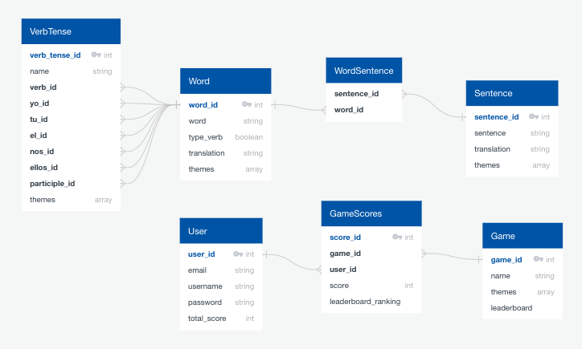

# Spanish Project backend

Deployed with render - https://spanish-project-ruby.onrender.com

### Technologies used

- Rails 7.0.8
- Ruby 3.2.2
- PostgreSQL
- rack-cors
- rspec
- factory_bot
- Continuous Integration (CI)
- Redis
- Sidekiq [(To see my work please view my open PR)](https://github.com/Pea75x/spanish-project-ruby/pull/1)
- Rack Attack

## Preview project

The FE is deployed on netlify - https://spanish-project.netlify.app

To log in as an admin -

```
Username: admin1
Password: qweqweqwe
```

## SideKiq

I decided to use Sidekiq to send an email each Friday to weekly top scorers for each game.

I configured **Redis** to handle these background jobs. I used a schedule.yml file to set **notification_job** to run every friday at mid-day.

```
notification_job:
  cron: '0 12 * * 5'
  class: 'NotificationJob'
  queue: default
```

I used **NotificationJob** to map through each game and find the current user with the highest score. It then passed the **user** and **game** as parameters to the **NotificationMailer**. The notificationMailer then sent out each individual email.

As I have a free account with Render which is limited (and don't need to send an email to myself each week) I did not deploy this PR to production but please have a look at the [open PR](https://github.com/Pea75x/spanish-project-ruby/pull/1).

## Continous Integration

I used GitHub Actions for CI which runs my specs and only deploys to production if all specs pass.

## Rack Attack

I used Rack Attack to block unknown routes, throttle spammy clients and prevent brute-force login attacks. More than 3 attempts to the login route should give you a response of 429.

## Database



### Verb Tense

I have used a **verb tense** model to create links between main words like **Tener** to the different tenses and pronouns like **Tengo** and **Tenido** that are in the **Words** model. With this I was then able to easily present the data together in the front end -


### Sentences and Words

I created a Many-to-Many Relationship between a **sentence** and the **words** within the sentence.

I then created a game that showed the sentence translation, where you need to type out each spanish word in the sentence. To do this I needed to ensure the words were stored in the **sentence.words** array in the correct order.


To do this I added the column **order** to the sentences/words table and in the model I added `default_scope { order(:order) }`. Then when creating a sentence I would add the word_ids in the correct order along with the other parameters and the below code adds the correct order within the controller.

```ruby
if word_ids
  word_ids.each_with_index do |word_id, index|
    SentencesWord.create(sentence_id: @sentence.id, word_id: word_id, order: index + 1)
  end
end
```

## Controllers

### Preparing Sentences for the games

For my reusable game component I need to filter all sentences by a particular theme (eg. Past tense) and select at random 15 sentences with the selected theme. To reduce data transfer and improve performance it would be best to do this in the back end. I have added the below code to the index in my controller -

```ruby
if params[:themes]
  @sentences = @sentences.where("themes && ARRAY[?]::varchar[]", params[:themes]).order("RANDOM()").limit(15)
end
```

It had to be able to take an array of themes in the params and give back any sentences that have either of the themes in the array.
